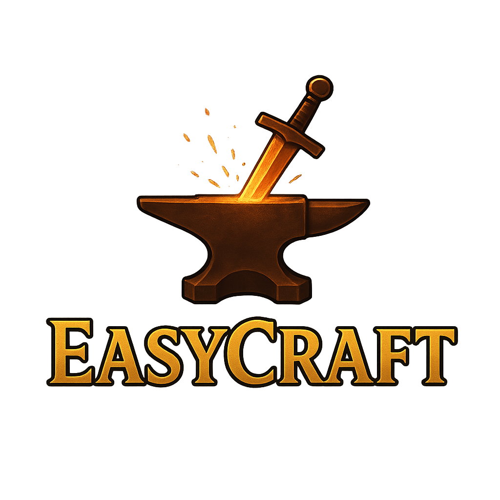

# 🎮 EasyCraft MMORPG WEB IDLE

<div align="center">




**Um MMORPG WEB IDLE de navegador moderno com gráficos 3D, combates em tempo real e sistemas complexos de progressão.**

</div>

---

## 📋 Índice

- [Visão Geral](#-visão-geral)
- [Jogue Agora](#-jogue-agora)
- [Detalhes do Projeto](#-detalhes-do-projeto)
- [Funcionalidades do Jogo](#-funcionalidades-do-jogo)
- [Tecnologias](#-tecnologias)
- [Arquitetura](#-arquitetura)
- [Padrões de Qualidade](#-padrões-de-qualidade)

---

## 🎯 Visão Geral

**EasyCraft** é um MMORPG WEB IDLE de navegador desenvolvido com foco em:

- 🎮 **Experiência de jogo em tempo real** – combates dinâmicos, dungeons cooperativas e interação entre jogadores
- 🌐 **Interface moderna** – SPA com renderização 3D usando `Three.js` e `@react-three/fiber`
- ⚡ **Backend escalável** – arquitetura modular com Express, TypeORM e PostgreSQL
- 📡 **Comunicação em tempo real** – WebSockets via `Socket.IO` para chat, batalhas e notificações

---

## 🚀 Jogue Agora

O jogo já está em **produção** e aberto para **testes**! 
Quem quiser testar e explorar o mundo de EasyCraft, acesse:

👉 **[http://easycraft.com.br/](http://easycraft.com.br/)**

---

## 📚 Detalhes do Projeto

Explore mais sobre o universo e a estrutura do EasyCraft:

- 📖 [**História e Lore**](Historia.md) – Conheça o mundo, as raças e a narrativa profunda por trás do jogo.
- 📊 [**Análise Geral do Projeto**](Analise-Geral-Projeto.md) – Visão técnica detalhada, desafios, soluções e arquitetura.

---

## ⚔️ Funcionalidades do Jogo

### Sistemas Principais

| Sistema | Descrição |
|---------|-----------|
| 🗡️ **Batalha** | Sistema de combate manual e automático (idle) com skills e efeitos de status |
| 🏰 **Dungeons** | Masmorras com múltiplos andares, chefes e recompensas exclusivas |
| ⚔️ **PvP** | Duelos e arenas entre jogadores |
| 🛡️ **Guildas** | Sistema completo de guildas com hierarquia e eventos |
| 💬 **Chat** | Chat global, privado e de guilda em tempo real |
| 🎒 **Inventário** | Sistema de inventário com filtros e organização |
| ⚒️ **Crafting** | Criação de itens e equipamentos |
| 🪨 **Gathering** | Coleta de recursos no mundo |
| 🛒 **Marketplace** | Mercado entre jogadores |
| 🏪 **NPC Shop** | Lojas de NPCs com inventários dinâmicos |
| 📜 **Quests** | Sistema de missões com recompensas |
| 🏆 **Ranking** | Rankings de jogadores por diversas métricas |
| 👥 **Amigos** | Sistema social de amizades |
| ✨ **Skills** | Árvore de habilidades por classe |
| 📚 **Tutorial** | Sistema guiado para novos jogadores |

### Características Técnicas

- **Renderização 3D** – Preview de personagens e cenários com Three.js
- **Estado em tempo real** – Sincronização via WebSocket
- **Sistema de status** – Buffs, debuffs e efeitos temporários
- **Painel administrativo** – Gerenciamento completo do jogo

---

## 🛠️ Tecnologias

### Frontend `v0.3.1`

| Categoria | Tecnologias |
|-----------|-------------|
| **Core** | React 18, TypeScript, Vite |
| **Estilização** | TailwindCSS 3.x |
| **3D** | Three.js, @react-three/fiber, @react-three/drei |
| **Estado** | Zustand |
| **Roteamento** | React Router DOM 6 |
| **Comunicação** | Axios, Socket.IO Client |
| **UI** | Lucide React, clsx, tailwind-merge |
| **Testes** | Vitest, @vitest/coverage-v8, JSDOM |
| **Qualidade** | ESLint, Prettier, TypeScript |

### Backend `v0.3.1`

| Categoria | Tecnologias |
|-----------|-------------|
| **Core** | Node.js ≥18, TypeScript 5.x |
| **Framework** | Express 4.x |
| **ORM** | TypeORM 0.3.x |
| **Banco de Dados** | PostgreSQL |
| **Cache** | Redis |
| **WebSocket** | Socket.IO 4.x |
| **Autenticação** | JWT (jsonwebtoken), bcryptjs |
| **Validação** | Zod |
| **Logs** | Pino, pino-pretty |
| **Segurança** | Helmet, CORS |
| **Testes** | Jest, ts-jest |

---

## 🏗️ Arquitetura

```
easycraft/
├── 📁 frontend/                    # SPA React + TypeScript (Vite)
│   ├── 📁 src/
│   │   ├── 📁 components/          # Componentes React (~150 arquivos)
│   │   │   ├── 📁 admin/           # Painel administrativo
│   │   │   ├── 📁 battle/          # UI de combate
│   │   │   ├── 📁 character/       # Componentes de personagem
│   │   │   ├── 📁 chat/            # Sistema de chat
│   │   │   ├── 📁 common/          # Componentes compartilhados
│   │   │   ├── 📁 dashboard/       # Dashboard principal
│   │   │   ├── 📁 dev/             # Ferramentas de desenvolvimento
│   │   │   ├── 📁 friends/         # Sistema de amigos
│   │   │   ├── 📁 gathering/       # Sistema de coleta
│   │   │   ├── 📁 guild/           # Interface de guildas
│   │   │   ├── 📁 hud/             # HUD do jogo
│   │   │   ├── 📁 layout/          # Componentes de layout
│   │   │   ├── 📁 npc-shop/        # Lojas de NPCs
│   │   │   ├── 📁 preload/         # Preload de assets
│   │   │   ├── 📁 pvp/             # Interface PvP
│   │   │   ├── 📁 town/            # Cidade/cenário 3D
│   │   │   ├── 📁 tutorial/        # Sistema tutorial
│   │   │   └── 📁 ui/              # Componentes base UI
│   │   ├── 📁 hooks/               # Hooks reutilizáveis
│   │   ├── 📁 pages/               # Páginas da aplicação
│   │   ├── 📁 services/            # Integração HTTP/WebSocket
│   │   ├── 📁 store/               # Estado global (Zustand)
│   │   ├── 📁 types/               # Definições TypeScript
│   │   └── 📁 utils/               # Utilitários
│   └── 📁 public/                  # Assets estáticos
│
├── 📁 backend/                     # API Node.js + Express
│   ├── 📁 src/
│   │   ├── 📁 config/              # Configurações
│   │   ├── 📁 db/                  # Banco de dados
│   │   ├── 📁 entities/            # Entidades TypeORM (~41)
│   │   ├── 📁 middleware/          # Middlewares Express
│   │   ├── 📁 modules/             # Módulos de domínio (~23 módulos)
│   │   │   ├── 📁 admin/           # Administração
│   │   │   ├── 📁 auth/            # Autenticação
│   │   │   ├── 📁 battle/          # Sistema de batalha
│   │   │   ├── 📁 character/       # Personagens
│   │   │   ├── 📁 chat/            # Chat
│   │   │   ├── 📁 classes/         # Classes do jogo
│   │   │   ├── 📁 crafting/        # Crafting
│   │   │   ├── 📁 dungeon/         # Dungeons
│   │   │   ├── 📁 friend/          # Amizades
│   │   │   ├── 📁 gathering/       # Coleta
│   │   │   ├── 📁 guild/           # Guildas
│   │   │   ├── 📁 inventory/       # Inventário
│   │   │   ├── 📁 item/            # Itens
│   │   │   ├── 📁 marketplace/     # Mercado
│   │   │   ├── 📁 models/          # Modelos 3D
│   │   │   ├── 📁 npc-shop/        # Lojas NPC
│   │   │   ├── 📁 pvp/             # PvP
│   │   │   ├── 📁 quest/           # Quests
│   │   │   ├── 📁 ranking/         # Rankings
│   │   │   ├── 📁 realtime/        # WebSocket
│   │   │   ├── 📁 skills/          # Habilidades
│   │   │   ├── 📁 status/          # Status/efeitos
│   │   │   └── 📁 tutorials/       # Tutoriais
│   │   ├── 📁 scripts/             # Scripts utilitários
│   │   └── 📁 utils/               # Utilitários
│   └── 📁 backups/                 # Backups do banco
│
├── 📁 .docs/                       # Documentação (~40 arquivos)
├── 📁 .dev/                        # Configurações de desenvolvimento
├── 📁 rulebook/                    # Regras de qualidade (~15 arquivos)
├── 📁 .github/                     # Workflows CI/CD
└── 📁 .windsurf/                   # Configurações do agente
```

---

## ✅ Padrões de Qualidade

O projeto segue padrões rigorosos de desenvolvimento com foco em qualidade e manutenibilidade:

- ✅ **Cobertura de Testes**: >90% no Backend e Frontend
- ✅ **Clean Code**: Zero warnings de lint, TypeScript em modo estrito
- ✅ **CI/CD**: Pipelines automatizados para verificação contínua
- ✅ **Arquitetura Modular**: Separação clara de responsabilidades

---

<div align="center">

**EasyCraft MMORPG WEB IDLE** | Desenvolvido com muita dificuldade e muito café

*Última atualização: Janeiro 2026*

</div>
