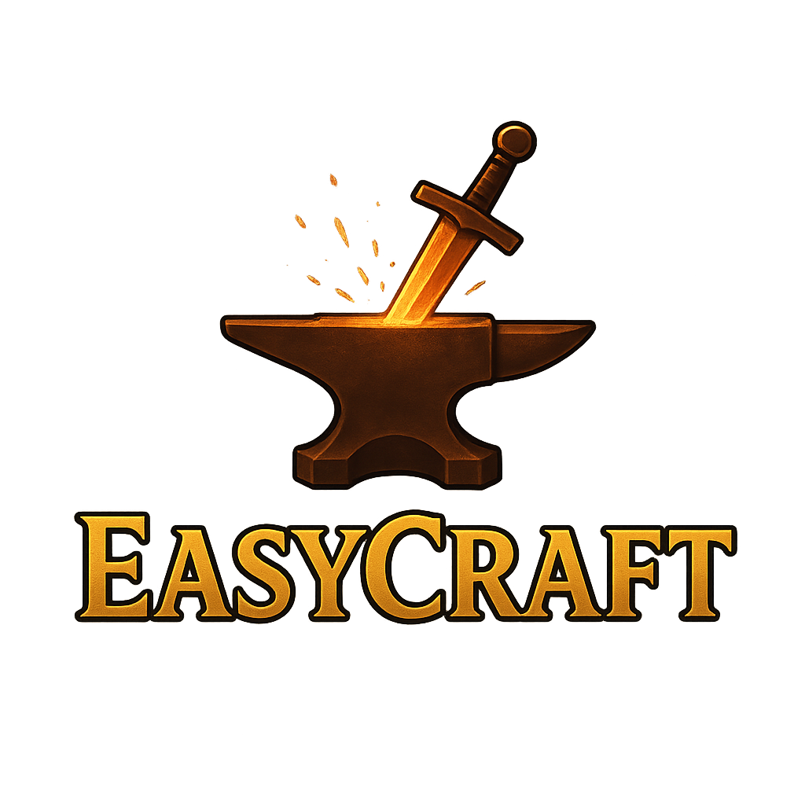

# EasyCraft RPG Online Idle




**RPG Online Idle de navegador com renderização 3D, combate por turnos, sistemas de progressão e multiplayer em tempo real.**

---

## Sumário

- [Visão Geral](#visão-geral)
- [Funcionalidades](#funcionalidades)
- [Stack Tecnológico](#stack-tecnológico)
- [Arquitetura](#arquitetura)
- [Detalhes do Projeto](#detalhes-do-projeto)

---

## Visão Geral

**EasyCraft** é um RPG Online Idle completo de fantasia medieval, desenvolvido como uma Single Page Application com renderização 3D no navegador. O projeto é um monorepo full-stack com backend API REST + WebSocket e frontend React com Three.js.

**Destaques técnicos:**

- **Full-stack TypeScript** — tipagem estrita end-to-end
- **Renderização 3D em tempo real** — Three.js + React Three Fiber para vila interativa, cenas de batalha e preview de personagens
- **Multiplayer via WebSocket** — Socket.IO para sincronização de estado, chat, presença e notificações
- **35 módulos de domínio** no backend com separação clara de responsabilidades
- **49 entidades** no banco de dados relacional com relacionamentos complexos
- **Internacionalização** — suporte completo PT/EN via react-i18next com 20+ namespaces
- **Multi-plataforma** — PWA + Electron (desktop Windows)

---

## Funcionalidades

### Sistemas de Jogo

| Sistema | Descrição |
| :------ | :-------- |
| **Batalha por Turnos** | Combate manual com skills, buffs/debuffs, uso de poções e IA de inimigos |
| **Batalha Idle** | Sistema automático com lógica autônoma e acompanhamento visual em tempo real |
| **Cripta (Dungeon)** | Masmorras com múltiplos andares, progressão de dificuldade e recompensas exclusivas |
| **PvP** | Duelos ranqueados entre jogadores com estatísticas e recompensas |
| **Guildas** | Sistema completo com hierarquia, banco, habilidades de guilda, chat e convites |
| **Pets** | Sistema de pets com templates, captura e gerenciamento |
| **Crafting** | Criação de itens com receitas, XP, favoritos e batch crafting |
| **Gathering** | Coleta de recursos com sessões configuráveis e cena 3D |
| **Enhancement** | Encantamento de equipamentos com níveis, chance de sucesso e sistema de durabilidade |
| **Marketplace** | Mercado entre jogadores com anúncios, comissão e histórico |
| **NPC Shop** | Lojas de NPCs com interface padronizada |
| **Loja do Jogador** | Sistema de aluguel de espaço para vender itens |
| **Inventário** | Grid de itens com filtros, ordenação e equipamento |
| **Quests** | Missões com objetivos, progresso rastreável e recompensas |
| **Skills** | Árvore de habilidades por classe com upgrade e cooldowns |
| **Classes** | Sistema de classe primária e secundária com bônus |
| **Conquistas** | Rastreamento de progresso com recompensas desbloqueáveis |
| **Recompensas Diárias** | Login rewards com milestones progressivos |
| **Ranking** | Rankings por nível, poder e PvP |
| **Chat** | Chat global, de guilda e mensagens diretas em tempo real |
| **Amigos** | Requisições, lista de amigos e status online/offline |
| **Correio** | Sistema de mensagens internas (mail do jogo e admin mail) |
| **Suporte** | Sistema de tickets de suporte in-game |
| **Tutorial** | Fluxo guiado com fila de diálogos para novos jogadores |
| **Feature Unlock** | Desbloqueio progressivo de funcionalidades por nível e tutorial |

### Sistemas Técnicos

| Sistema | Descrição |
| :------ | :-------- |
| **Vila 3D Multiplayer** | Cenário 3D interativo com movimento, NPCs animados e sincronização de jogadores via WebSocket |
| **Cena de Batalha 3D** | Visualização de combate com animações, efeitos visuais e HUD sobreposto |
| **Preview 3D de Personagem** | Modelo baseado na classe com sistema de attachments de equipamentos |
| **Sistema de Áudio** | Efeitos sonoros e música ambiente integrados ao gameplay |
| **Painel Administrativo** | CRUD de todas as entidades, logs de auditoria, backup, controle de servidor e editor 3D da vila |
| **PWA** | Progressive Web App com cache de assets 3D (GLB), imagens e áudio via Workbox |
| **Desktop (Electron)** | Build nativo para Windows via electron-builder |
| **i18n** | Internacionalização PT/EN com 20+ namespaces e detecção automática de idioma |

---

## Stack Tecnológico

### Frontend `v0.4.8`

| Camada | Tecnologias |
| :----- | :---------- |
| **Core** | React 18, TypeScript 5, Vite 7 |
| **3D** | Three.js 0.159, @react-three/fiber, @react-three/drei |
| **Estado** | Zustand 4.4 (12 stores) |
| **Estilização** | TailwindCSS 3.3, clsx, tailwind-merge, cva |
| **Comunicação** | Axios, Socket.IO Client 4.7 |
| **Roteamento** | React Router DOM 6 (HashRouter) |
| **i18n** | i18next 26, react-i18next 17 |
| **UI** | Lucide React (ícones) |
| **Desktop** | Electron 40, electron-builder |
| **PWA** | vite-plugin-pwa, Workbox |
| **Testes** | Vitest, @vitest/coverage-v8, JSDOM |
| **Qualidade** | ESLint 8 (flat config), Prettier, TypeScript strict |

### Backend `v0.4.8`

| Camada | Tecnologias |
| :----- | :---------- |
| **Core** | Node.js >= 18, TypeScript 5.3, Express 4.18 |
| **ORM** | TypeORM 0.3 (49 entidades, schema patches) |
| **Banco de Dados** | PostgreSQL 15 |
| **Cache** | Redis 7 |
| **WebSocket** | Socket.IO 4.7 |
| **Autenticação** | JWT, bcryptjs |
| **Validação** | Zod |
| **Logging** | Pino, pino-pretty |
| **Segurança** | Helmet, CORS |
| **Testes** | Jest, ts-jest |

### Infraestrutura

| Componente | Tecnologia |
| :--------- | :--------- |
| **Containerização** | Docker Compose (dev + prod + SSL) |
| **Reverse Proxy** | Nginx com SSL |
| **Banco** | PostgreSQL 15 Alpine (200 max connections, 256MB shared buffers) |
| **Cache** | Redis 7 Alpine |

---

## Arquitetura

### Visão Geral

```
Cliente (Browser/Electron)
  │
  ├─ HTTP REST ──────► Express API (35 módulos)
  │                        │
  │                        ├── TypeORM ──► PostgreSQL (49 tabelas)
  │                        └── Redis ────► Cache / Sessions
  │
  └─ WebSocket ──────► Socket.IO Server
                           │
                           ├── Rooms (chat, guild, battle)
                           ├── Presença / Vila multiplayer
                           └── Notificações em tempo real
```

### Estrutura do Monorepo

```text
easycraft/
├── backend/                        # API Node.js + Express + TypeORM
│   └── src/
│       ├── config/                 # Configurações (logger, etc.)
│       ├── db/                     # DataSource + schema patches
│       ├── entities/               # 49 entidades TypeORM
│       ├── middleware/             # Auth, activity tracking, etc.
│       ├── modules/                # 35 módulos de domínio
│       │   ├── achievement/        # Conquistas
│       │   ├── admin/              # Painel administrativo
│       │   ├── auth/               # Autenticação (JWT)
│       │   ├── battle/             # Sistema de combate
│       │   ├── bonus/              # Multiplicadores globais
│       │   ├── character/          # Personagens e stats
│       │   ├── chat/               # Chat em tempo real
│       │   ├── classes/            # Classes do jogo
│       │   ├── crafting/           # Criação de itens
│       │   ├── crypt/              # Masmorras
│       │   ├── daily-rewards/      # Recompensas diárias
│       │   ├── enhancement/        # Encantamento + durabilidade
│       │   ├── feature-unlock/     # Desbloqueio progressivo
│       │   ├── friend/             # Amizades
│       │   ├── gathering/          # Coleta de recursos
│       │   ├── guild/              # Guildas + habilidades
│       │   ├── inventory/          # Inventário
│       │   ├── item/               # Itens
│       │   ├── mail/               # Correio do jogo
│       │   ├── marketplace/        # Mercado de jogadores
│       │   ├── npc-buyer/          # NPC comprador
│       │   ├── npc-shop/           # Lojas de NPC
│       │   ├── pet/                # Sistema de pets
│       │   ├── pvp/                # PvP e ranking
│       │   ├── quest/              # Missões
│       │   ├── ranking/            # Rankings
│       │   ├── realtime/           # WebSocket service
│       │   ├── shop-rental/        # Loja do jogador
│       │   ├── skills/             # Habilidades
│       │   ├── status/             # Buffs e debuffs
│       │   ├── support/            # Tickets de suporte
│       │   ├── system/             # Config global
│       │   ├── tutorials/          # Sistema tutorial
│       │   └── village/            # Vila multiplayer
│       ├── scripts/                # Scripts utilitários
│       └── utils/                  # Utilitários
│
├── frontend/                       # SPA React + TypeScript (Vite)
│   └── src/
│       ├── components/             # 329 componentes React
│       │   ├── admin/              # Painel administrativo
│       │   ├── battle/             # UI de combate 3D
│       │   ├── character/          # Criação e preview
│       │   ├── chat/               # Sistema de chat
│       │   ├── common/             # Componentes compartilhados
│       │   ├── crypt/              # Interface de masmorras
│       │   ├── dashboard/          # Dashboard + 67 views
│       │   ├── dialogue/           # Fila de diálogos
│       │   ├── friends/            # Sistema de amigos
│       │   ├── gathering/          # Coleta de recursos
│       │   ├── guild/              # Interface de guildas
│       │   ├── hud/                # HUD do jogo
│       │   ├── layout/             # Layout base
│       │   ├── npc-shop/           # Lojas de NPC
│       │   ├── pvp/                # Interface PvP
│       │   ├── session/            # Gestão de sessão
│       │   ├── support/            # Suporte in-game
│       │   ├── town/               # Vila 3D
│       │   ├── tutorial/           # Tutorial guiado
│       │   └── ui/                 # Componentes base UI
│       ├── hooks/                  # Custom hooks
│       ├── i18n/                   # Internacionalização (PT/EN)
│       ├── pages/                  # Páginas da aplicação
│       ├── services/               # 42 serviços (HTTP + WS)
│       ├── store/                  # 12 Zustand stores
│       ├── types/                  # Definições TypeScript
│       └── utils/                  # Utilitários
│
├── nginx/                          # Configurações Nginx + SSL
├── scripts/                        # Scripts de deploy
├── docker-compose.yml              # Infraestrutura dev
├── docker-compose.prod.yml         # Infraestrutura prod
└── docker-compose.ssl.yml          # SSL
```

### Padrões de Arquitetura

**Backend:** `Service (lógica de negócio) → Controller (validação + response) → Routes (Express Router)`
- Services são singletons exportados
- Validação de input via Zod
- Formato de response padronizado: `{ success, data?, error? }`
- Schema patches via `applySchemaPatches()` no DataSource (sem migrations tradicionais)
- Entidades registradas centralmente em `ALL_ENTITIES`

**Frontend:** `Zustand Store (estado) → Service (API calls) → Component (UI)`
- Functional components + hooks
- React Three Fiber para renderização 3D
- Estilização com Tailwind + `cva` (variantes) + `cn()` (merge de classes)
- Tema medieval customizado (forge.*, rarity.*, medieval.*)
- HashRouter para compatibilidade com Electron
- Persistência de stores via `safeStorage`

---

## Detalhes do Projeto

- [Análise Técnica Completa](Analise-Geral-Projeto.md) — Arquitetura detalhada, sistemas implementados, entidades, componentes e métricas
- [Lore e Worldbuilding](Historia.md) — Narrativa, raças, classes e contexto do universo do jogo

---

**EasyCraft RPG Online Idle** | Full-stack TypeScript

Última atualização: Abril 2026
